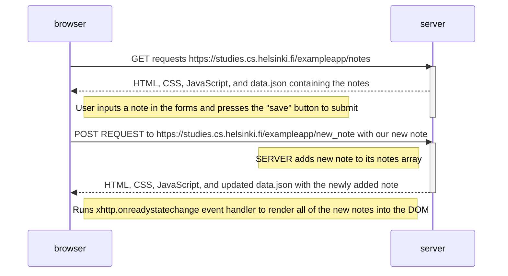

```mermaid
sequenceDiagram
    participant browser
    participant server

    browser->>server: GET requests https://studies.cs.helsinki.fi/exampleapp/notes
    activate server
    server-->>browser: HTML, CSS, JavaScript, and data.json containing the notes
    Note right of browser:User inputs a note in the forms and presses the "save" button to submit
    deactivate server

    browser->>server: POST REQUEST to https://studies.cs.helsinki.fi/exampleapp/new_note with our new note
    activate server
    Note left of server: SERVER adds new note to its notes array
    server-->>browser: HTML, CSS, JavaScript, and updated data.json with the newly added note
    deactivate server
    Note right of browser: Runs xhttp.onreadystatechange event handler to render all of the new notes into the DOM
```