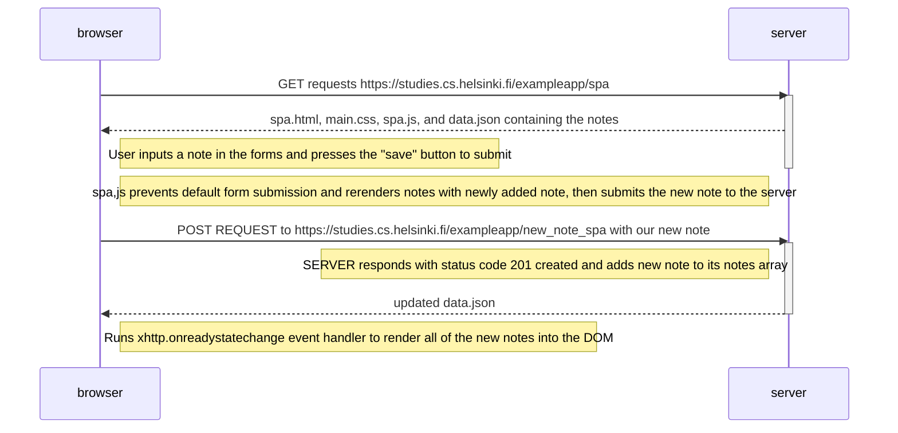

```mermaid
sequenceDiagram
    participant browser
    participant server

    browser->>server: GET requests https://studies.cs.helsinki.fi/exampleapp/spa
    activate server
    server-->>browser: spa.html, main.css, spa.js, and data.json containing the notes
    Note right of browser:User inputs a note in the forms and presses the "save" button to submit
    deactivate server
     Note right of browser: spa,js prevents default form submission and rerenders notes with newly added note, then submits the new note to the server
    browser->>server: POST REQUEST to https://studies.cs.helsinki.fi/exampleapp/new_note_spa with our new note
   
    activate server
    Note left of server: SERVER responds with status code 201 created and adds new note to its notes array
    server-->>browser: updated data.json
    deactivate server
    Note right of browser: Runs xhttp.onreadystatechange event handler to render all of the new notes into the DOM
```